<picture>
  <source media="(prefers-color-scheme: dark)" srcset="assets/banner-dark.svg">
  <source media="(prefers-color-scheme: light)" srcset="assets/banner-light.svg">
  
</picture>

<p align="center">
  <b>Software e hardware, bem estruturados.</b><br>
  Desenvolvemos aplicativos sob medida e sistemas embarcados para resolver problemas do mundo real —<br>
  do app no bolso do vendedor ao equipamento instalado na quadra.
</p>

<p align="center">
  <a href="https://strukti.vercel.app"></a>
  <a href="mailto:struktisolutions@gmail.com"></a>
  <a href="https://www.linkedin.com/company/LINKEDIN_STRUKTI"></a>
</p>

---

### 🔧 Produtos de hardware

| | Produto | O que faz |
|:-:|---|---|
| 📹 | **Replay para Quadras** | Câmeras e processamento local que gravam a partida e entregam o melhor lance no celular do jogador, na hora. |
| 🅿️ | **Estacionamento Inteligente** | Sensores e painel em tempo real para mostrar quais vagas estão livres e organizar o fluxo de veículos. |

### 📱 Aplicativos

| | Projeto | O que faz | Stack |
|:-:|---|---|---|
| 🧭 | **Rota de Vendas** | App *offline-first* para vendedores externos: pedidos, clientes e rotas sem depender de sinal, com sincronização automática. | Flutter · Android · Windows |
| 🎉 | **GoTogether** | App social para encontrar rolês e companhia — junta quem quer sair com quem está indo para o mesmo lugar. | Mobile |
| 🌐 | **Site Strukti** | Vitrine da marca com formulário único de contato: replay, estacionamento, aplicativo ou outro. | Web |

> 💼 **Aplicativos sob medida:** projetamos e construímos apps mobile, desktop e web para o processo de cada cliente — inclusive para quem trabalha onde a internet não chega.

---

### 🧱 Como trabalhamos

```text
entender quem usa  →  prototipar cedo  →  testar em campo  →  evoluir junto
```

- **Do circuito à tela** — eletrônica, firmware, app, painel e suporte no mesmo time.
- **Offline e robusto** — testamos sem sinal, com bateria fraca e com usuário apressado.
- **Código limpo** — Conventional Commits, revisão em todo PR e versionamento semântico.

### 🛠️ Tecnologias

<p>
  
  
  
  
  
  
  
</p>

---

<p align="center">
  <sub>Tem um problema que tecnologia de prateleira não resolve? <a href="https://strukti.vercel.app"><b>Conte pra gente →</b></a></sub><br>
  <sub>© Strukti Solutions</sub>
</p>
